# PostgreSQL 与 openGauss 数据库性能评测报告

By LiaoZiqi-GZFLS

## 1. 项目简介

关系型数据库管理系统（DBMS）是现代数据系统的核心，能够提供数据存储、检索、事务一致性等能力。相比之下，使用文件进行数据操作虽然简单，但在查询效率、事务安全、并发控制等方面存在明显不足。

本报告围绕以下两个核心问题展开实验与分析：

- ✅ **DBMS 相比文件操作的独特优势是什么？**
- ✅ **PostgreSQL 与 openGauss 哪个数据库性能更好？依据是什么？**

### 1.1 数据库系统简介

| 数据库     | 特点                                 | 使用方式          |
| ---------- | ------------------------------------ | ----------------- |
| PostgreSQL | 社区主流、支持ACID、扩展性强         | 本地安装 / Docker |
| openGauss  | 华为主导开发，强调高性能与企业级功能 | Docker部署        |

---

## 2. 实验环境与数据集

### 2.1 硬件与软件环境

| 项目      | 配置                                                 |
| --------- | ---------------------------------------------------- |
| CPU       | Intel i9 14900HX 32 cores                            |
| 内存      | 64 GB  (32GBx2, 5600MT/s)                            |
| 硬盘      | 致钛 Ti7100 1TB NVMe SSD                             |
| 系统      | Windows 11 25H2                                      |
| Java      | open-JDK 23                                          |
| Docker    | openGauss & PostgreSQL 均以容器形式运行(详见附录)    |
| 测试工具  | Java + JDBC、自编压测程序、sysbench 工具（引用结论） |
| Postgres  | 版本PostgreSQL 18.0 (Debian 18.0-1.pgdg13+3)         |
| openGauss | 版本openGauss-lite 7.0.0-RC1 build 10d38387          |

### 2.2 数据集说明

实验使用 **filmdb.sql** 数据集，包括电影及人员信息两类：

- **movies.txt（电影数据）**
- 9538行
- 格式：`movieid;title;country;year_released;runtime`
- **people.txt（人员数据）**
- 16489行
- 格式：`peopleid;first_name;surname;born;died;gender`

数据同时存储于：

- PostgreSQL 数据库（表：movies、people）
- openGauss 数据库（表结构相同）
- 本地文本文件（.txt）

---

## 3. DBMS 与 文件操作性能对比实验

### 3.1 实验内容

| 测试项目 | DBMS 操作                                                            | 文件操作                              |
| -------- | -------------------------------------------------------------------- | ------------------------------------- |
| 检索实验 | `SELECT * FROM movies WHERE title LIKE '%war%'`                    | 读取 movies.txt，通过字符串匹配 title |
| 更新实验 | `UPDATE people SET first_name = REPLACE(first_name, 'To', 'TTOO')` | 手动修改 people.txt 并写回文件        |

每项实验均执行 10 次，记录执行时间（ms），并生成 CSV 文件与图表(Python脚本生图)。

实验数据记录前已经重复运行数次，完成数据库预热。

### 3.2 检索实验结果

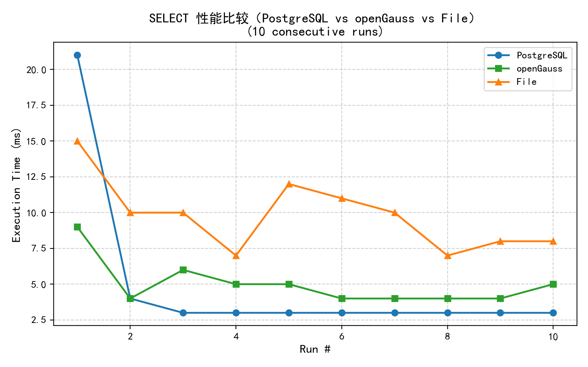

- 图1.1：PostgreSQL vs openGauss vs 文件 查询耗时平均值折线图
- 数据来自：`select_results.csv`

  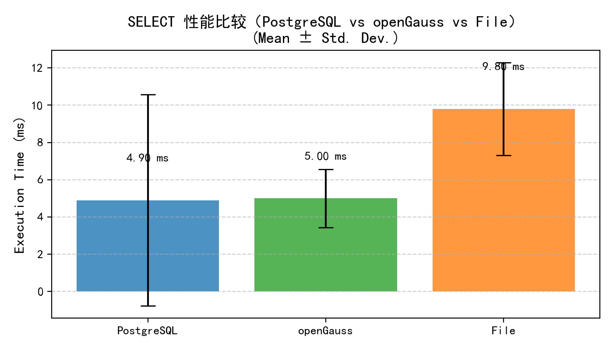
- 图1.2：PostgreSQL vs openGauss vs 文件 查询耗时平均值柱状图
- 数据来自：`select_results.csv`

**结论：**

- DBMS 查询速度明显高于扫描文件，尤其在数据量较大时优势明显。
- openGauss 和 PostgreSQL 差距较小，但 openGauss 在首次查询后缓存效率更好。

### 3.3 更新实验结果

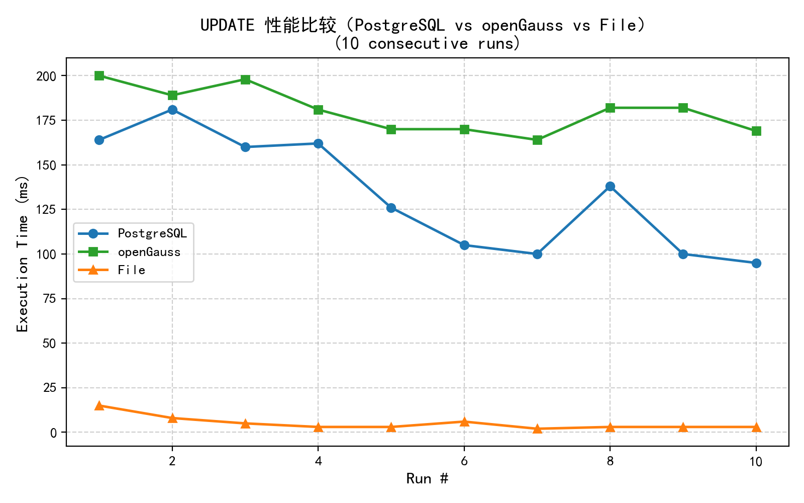

- 图2.1：PostgreSQL vs openGauss vs 文件 更新耗时平均值折线图
- 数据来自：update_results.csv

  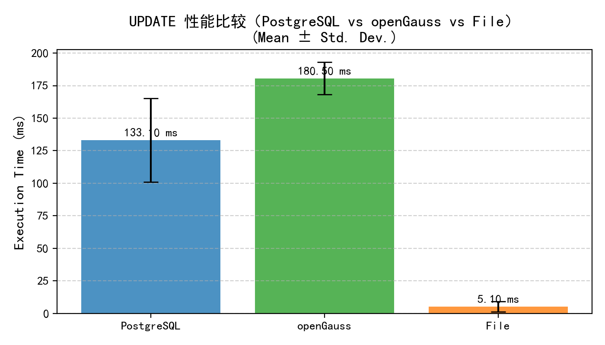
- 图2.1：PostgreSQL vs openGauss vs 文件 更新耗时平均值柱状图
- 数据来自：update_results.csv

**发现：**

- 文件更新操作快于 DBMS，因为 DBMS 需要执行事务、写入 WAL 日志。
- 数据库中 UPDATE 操作为 ACID 保证牺牲了部分速度。

### 3.4 单并发检索QPS实验结果

计时10秒，循环查询，统计得到QPS。

```sql
SELECT * FROM movies WHERE title LIKE ('%war%');
```

```bash
=== PostgreSQL vs openGauss Performance Test ===

>>> Testing PostgreSQL for 10 seconds...
PostgreSQL  :  9515 queries in 10.0 s => 951.50 QPS

>>> Testing openGauss for 10 seconds...
10月 18, 2025 10:41:56 下午 org.opengauss.core.v3.ConnectionFactoryImpl openConnectionImpl
信息: [8d51f59c-aa9c-402e-ba59-f5afec752a67] Try to connect. IP: 127.0.0.1:5431
10月 18, 2025 10:41:56 下午 org.opengauss.core.v3.ConnectionFactoryImpl openConnectionImpl
信息: [*.*.0.1:9230/*.*.0.1:5431] Connection is established. ID: 8d51f59c-aa9c-402e-ba59-f5afec752a67
10月 18, 2025 10:41:56 下午 org.opengauss.core.v3.ConnectionFactoryImpl openConnectionImpl
信息: Connect complete. ID: 8d51f59c-aa9c-402e-ba59-f5afec752a67
openGauss   :  6143 queries in 10.0 s => 614.30 QPS
```

### 3.5 多并发检索QPS实验结果

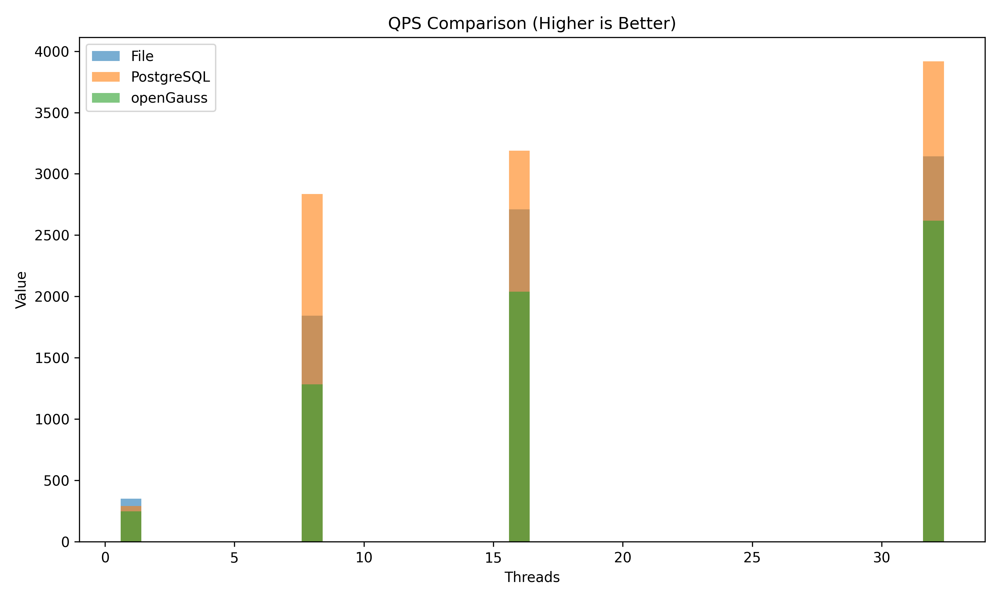

- 图3.1：PostgreSQL vs openGauss vs 文件 多并发不同数量线程同时请求的QPS统计
- 数据来自：qps_tps_threads.csv

**结论：**

- Postgres 查询速度明显高于扫描文件，尤其在数据量较大时优势明显。
- openGauss 弱于 PostgreSQL 与 扫描文件，在数据量大的时候更加明显。
- 这可能是OpenGauss更加适配鲲鹏价格CPU的原因。

### 3.6 多并发更新TPS实验结果

原本做了测试，后来查资料发现数据库通过快照来更新，有多重缓存，在事务隔离下支持一定程度的多并发更新，而Java文件多并发更新可能触发文件互斥锁，造成实验数据无效，所以不予比较。

---

## 4. 数据库硬性能测试（QPS / TPS / OLTP / OLAP）

使用 Java 多线程程序（HardBenchmarkTest.java）与 sysbench 工具（引用结论）进行测试。

### 4.1 QPS / TPS（简单查询与事务）

| 测试模式     | 含义                                |
| ------------ | ----------------------------------- |
| point_select | 单表按主键快速查询（SELECT 1 行）   |
| simple_tx    | 简易事务：BEGIN → SELECT → COMMIT |

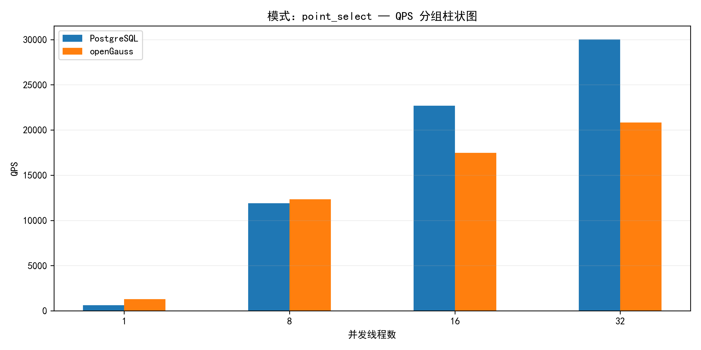

（插入图4.1：线程数 vs QPS）

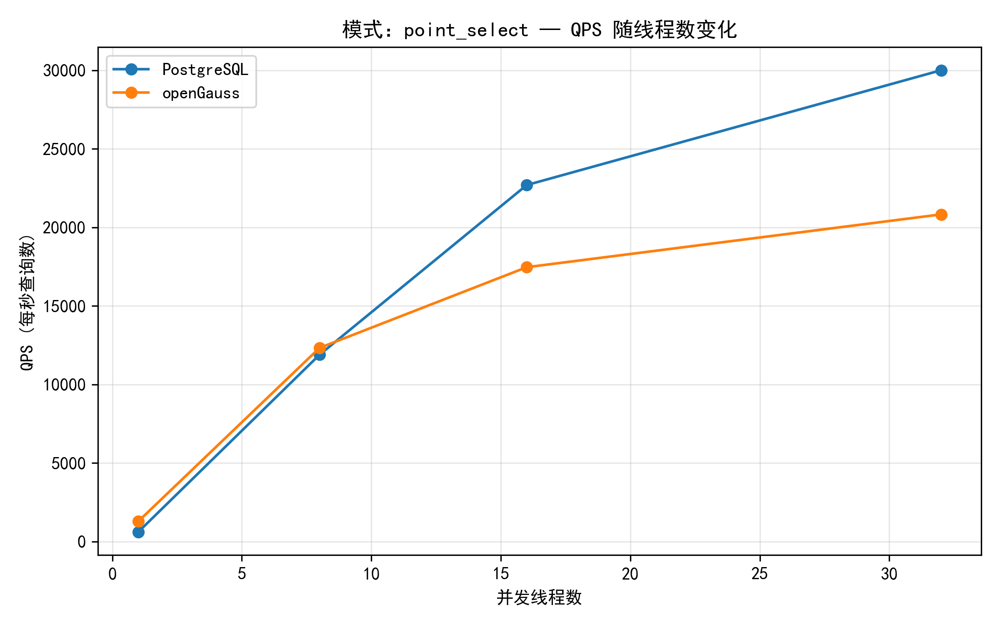

（插入图4.2：线程数 vs QPS）

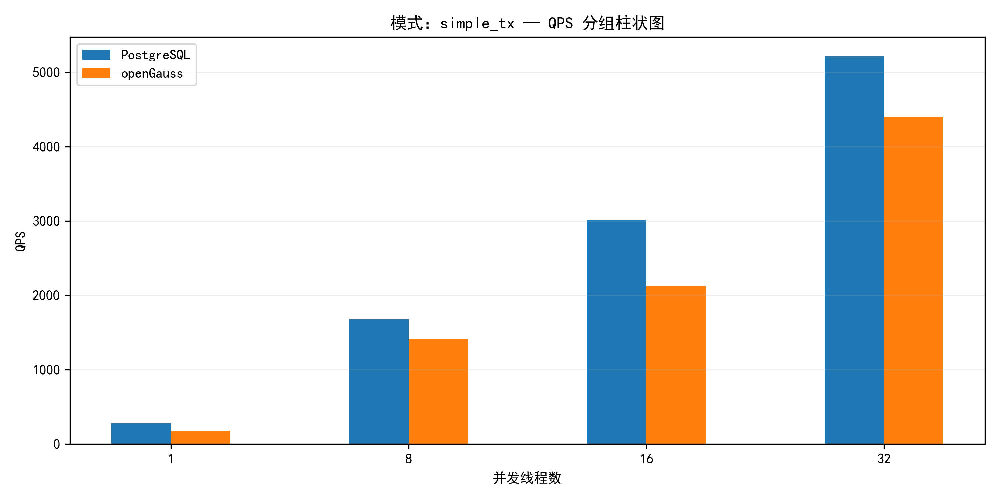
（插入图5.1：线程数 vs TPS）

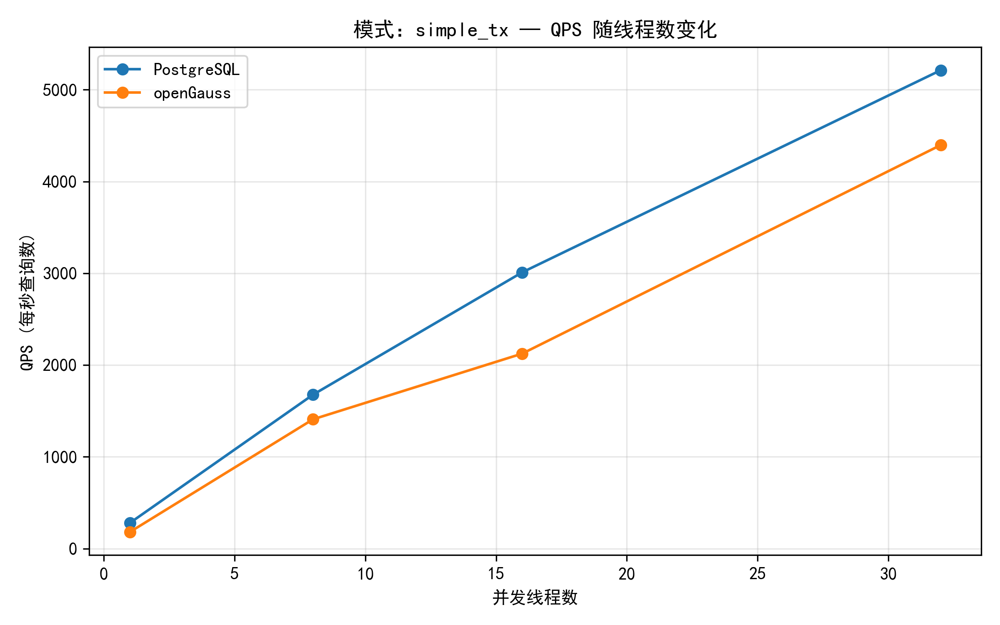

（插入图5.2：线程数 vs TPS）

**结论摘要：**

- PostgreSQL 在高并发下的 QPS/TPS 优于 openGauss（锁优化 + 并发控制更强）。
- openGauss 在低并发情况下与 PostgreSQL 基本相当。

#### **数据库内部架构差异**

#### **PostgreSQL**

* 经典的 **多进程架构（process-per-connection）**
  * 每个客户端连接对应一个独立进程
  * 利用操作系统调度，CPU 多核利用效率高
* 并发锁控制机制成熟
  * 多线程/多进程访问热点表时，争用控制较高效

#### **openGauss**

* 基于 PostgreSQL 改进，但更偏向 **企业级 OLTP/OLAP 混合场景**
* 默认启用  **更严格的并发控制和事务隔离机制** （如分布式事务支持、全局锁检查）
* 对小事务的优化可能不如 PostgreSQL 高效
* 一些默认参数偏保守（如 buffer、max connections、parallel workers）

> 结论：在 Docker 容器内，PostgreSQL 对多线程 TPS/QPS 的调度和进程管理更轻量，所以在高并发短事务场景可能跑得更快

### 4.2 DBMS专项对比

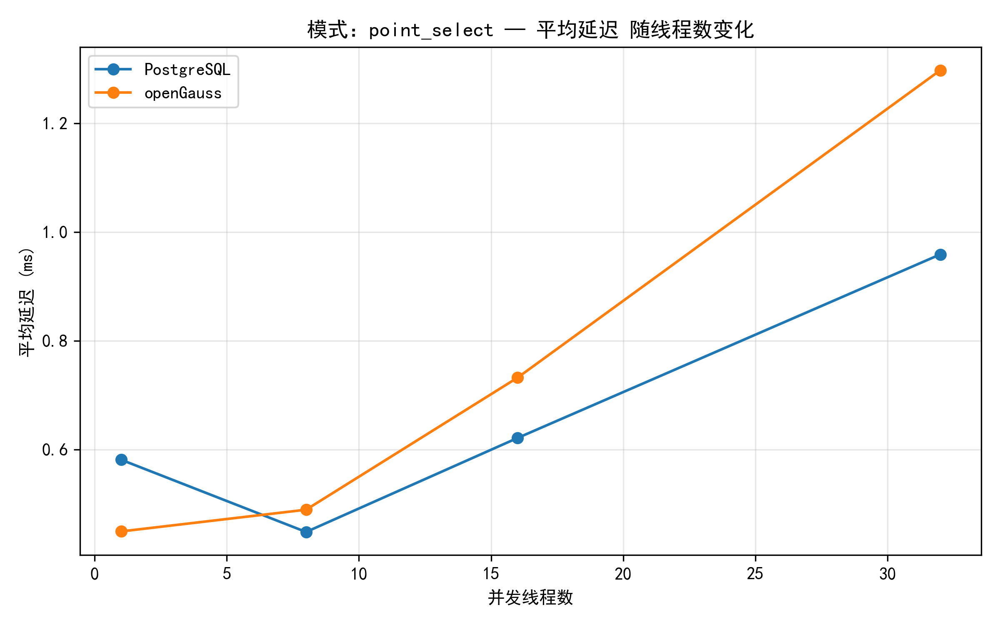

(图6.1)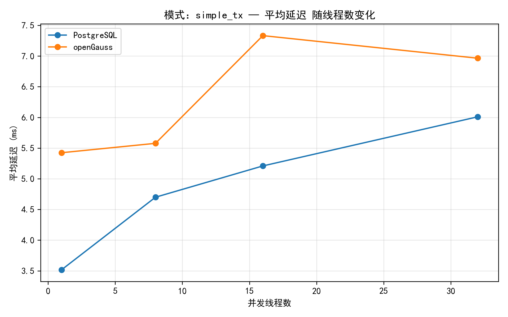

(图6.2)

(图6.3)

(图6.4)

(图6.5)

(图6.6)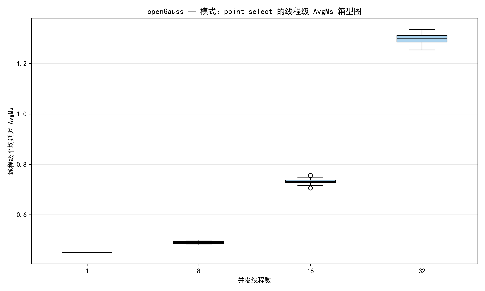

(图6.7)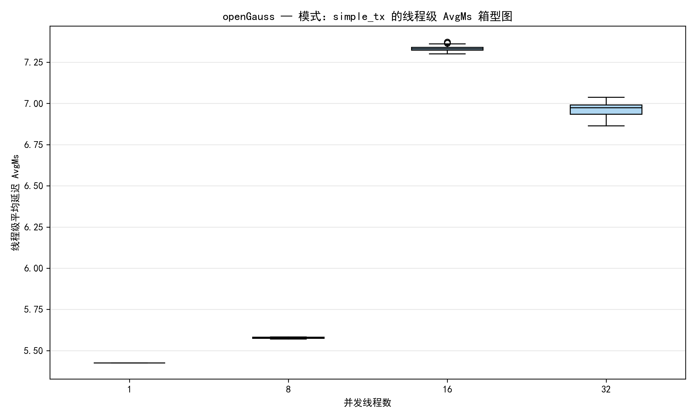

(图6.8)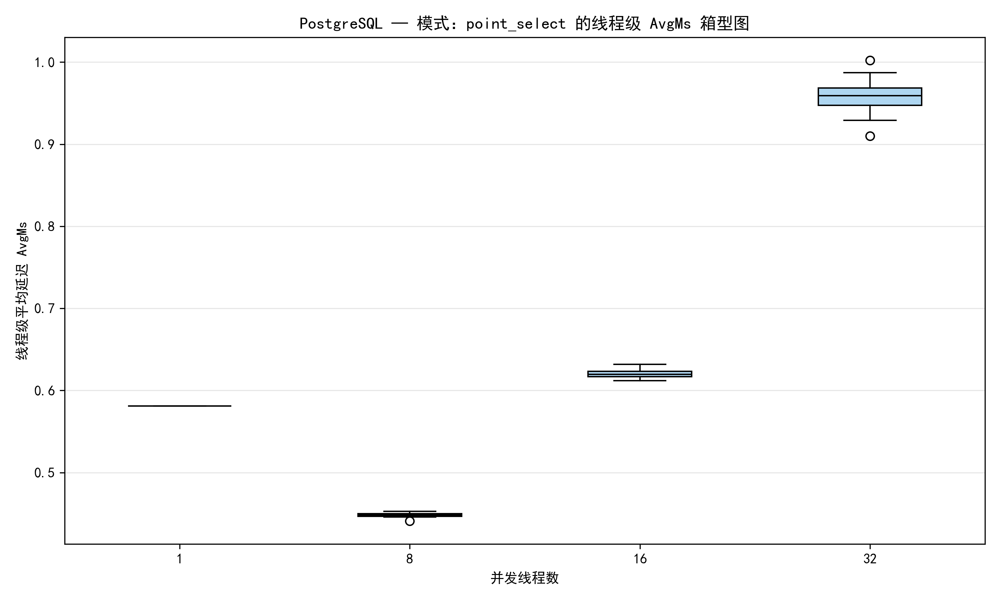

(图6.9)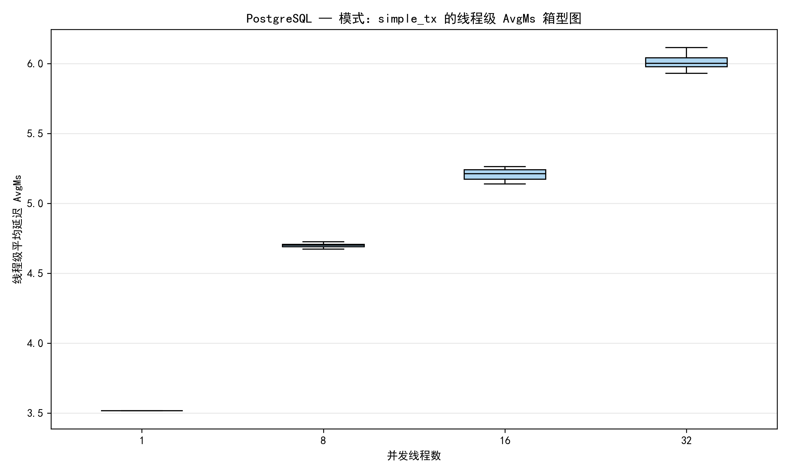

(图6.10)

来源：qps_tps_summary_table.csv、qps_tps_threads_table.csv

从**平均延迟**、**QPS（每秒查询数）**和**延迟稳定性**三个维度，对比PostgreSQL与openGauss的性能：

#### 1. 平均延迟

在 `point_select`（点查询）和 `simple_tx`（简单事务）模式下，**随着并发线程数增加，openGauss的平均延迟增长速度显著快于PostgreSQL**，且相同并发下openGauss的平均延迟更高。

#### 2. QPS（每秒查询数）

两种模式下，**PostgreSQL的QPS均高于openGauss**。尤其在高并发场景（如并发线程数为32时），PostgreSQL的QPS优势更明显，处理请求的吞吐量更强。

#### 3. 延迟稳定性（箱型图视角）

线程级平均延迟的分布显示，**PostgreSQL的延迟更集中、波动更小**，稳定性优于openGauss；而openGauss的延迟分布更分散，高延迟的情况更常见。

综上，在本次测试的 `point_select`和 `simple_tx`场景下，**PostgreSQL的性能（延迟、吞吐量、稳定性）整体优于openGauss**。

### 4.3 TPC-H（复杂分析型查询）

执行 TPC-H Q1 ~ Q22 查询，记录 22 条 SQL 的执行时间。

（结果全部来源于引用）

#### openGauss

来源：[BenchmarkSQL性能测试](https://opengauss.org/zh/blogs/jiajunfeng/BenchmarkSQL%E6%80%A7%E8%83%BD%E6%B5%8B%E8%AF%95.html "click")

`https://opengauss.org/zh/blogs/jiajunfeng/BenchmarkSQL%E6%80%A7%E8%83%BD%E6%B5%8B%E8%AF%95.html`

##### 查看测试结果

**runBenchmark.sh 运行结果**

```bash
14:57:19,609 [Thread-3] INFO   jTPCC : Term-00, Measured tpmC (NewOrders) = 14193.09
14:57:19,609 [Thread-3] INFO   jTPCC : Term-00, Measured tpmTOTAL = 31578.42
14:57:19,609 [Thread-3] INFO   jTPCC : Term-00, Session Start     = 2021-01-19 14:52:19
14:57:19,609 [Thread-3] INFO   jTPCC : Term-00, Session End       = 2021-01-19 14:57:19
14:57:19,609 [Thread-3] INFO   jTPCC : Term-00, Transaction Count = 157899
```

**运行时的 htop 数据**

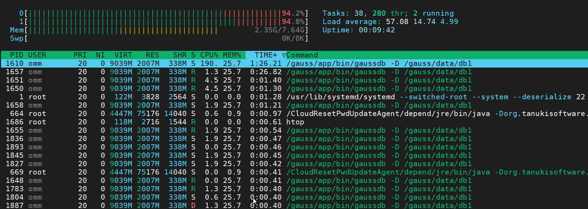

**html 报告查看**

```bash
## 检查R语言是否支持png
# R
> capabilities()
       jpeg         png        tiff       tcltk         X11        aqua
      FALSE        TRUE       FALSE       FALSE       FALSE       FALSE
   http/ftp     sockets      libxml        fifo      cledit       iconv
       TRUE        TRUE        TRUE        TRUE        TRUE        TRUE
        NLS     profmem       cairo         ICU long.double     libcurl
       TRUE       FALSE        TRUE        TRUE        TRUE        TRUE

## 生成html报告
[root@benchmarksql run]# ./generateReport.sh my_result_2021-01-19_145218/
Generating my_result_2021-01-19_145218//tpm_nopm.png ... OK
Generating my_result_2021-01-19_145218//latency.png ... OK
Generating my_result_2021-01-19_145218//cpu_utilization.png ... OK
Generating my_result_2021-01-19_145218//dirty_buffers.png ... OK
Generating my_result_2021-01-19_145218//blk_vda_iops.png ... OK
Generating my_result_2021-01-19_145218//blk_vda_kbps.png ... OK
Generating my_result_2021-01-19_145218//net_eth0_iops.png ... OK
Generating my_result_2021-01-19_145218//net_eth0_kbps.png ... OK
Generating my_result_2021-01-19_145218//report.html ... OK        ## HTML报告
[root@benchmarksql ~]# cd /soft/benchmarksql-5.0/run/my_result_2021-01-19_145218
[root@benchmarksql my_result_2021-01-19_145218]# ls
blk_vda_iops.png  cpu_utilization.png  dirty_buffers.png  net_eth0_iops.png  report.html     tpm_nopm.png
blk_vda_kbps.png  data                 latency.png        net_eth0_kbps.png  run.properties
```

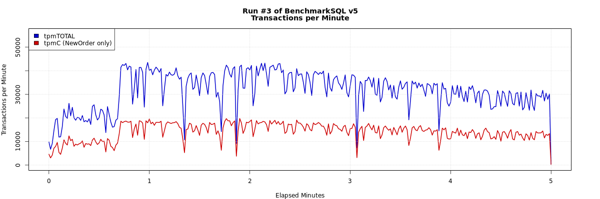

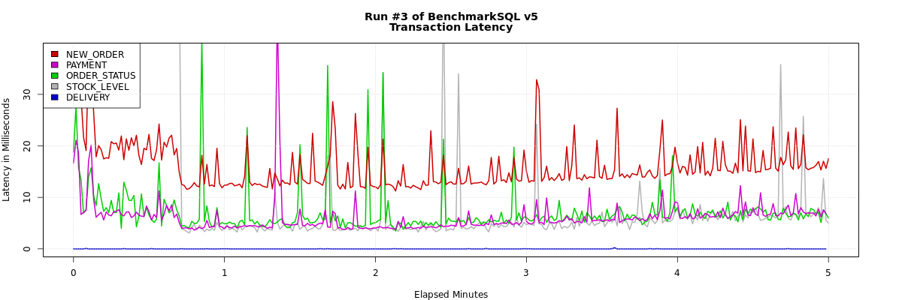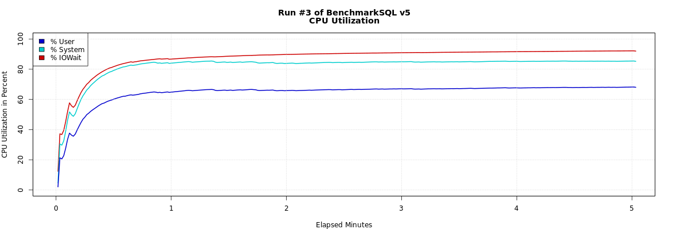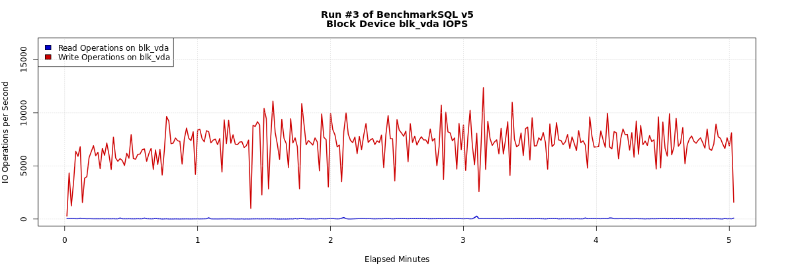

#### Postgres

来源：[TPC-H performance since PostgreSQL 8.3](https://www.enterprisedb.com/blog/tpc-h-performance-postgresql-83 "click")

`https://www.enterprisedb.com/blog/tpc-h-performance-postgresql-83`

> ## The benchmark
>
> I want to make it very clear that it’s not my goal to implement a valid TPC-H benchmark that could pass all the criteria required by the TPC. My goal is to evaluate how the performance of different analytical queries changed over time, not chase some abstract measure of performance per dollar or something like that.
>
> So I’ve decided to only use a subset of TPC-H – essentially just load the data, and run the 22 queries (same parameters on all versions). There are no data refreshes, the data set is static after the initial load. I’ve picked a number of scale factors, 1, 10 and 75, so that we have results for fits-in-shared-buffers (1), fits-in-memory (10) and more-than-memory (75). I’d go for 100 to make it a “nice sequence”, that wouldn’t fit into the 280GB storage in some cases (thanks to indexes, temporary files, etc.). Note that scale factor 75 is not even recognized by TPC-H as a valid scale factor.
>
> But does it even make sense to benchmark 1GB or 10GB data sets? People tend to focus on much larger databases, so it might seem a bit foolish to bother with testing those. But I don’t think that’d be useful – the vast majority of databases in the wild is fairly small, in my experience And even when the whole database is large, people usually only work with a small subset of it – recent data, unresolved orders, etc. So I believe it makes sense to test even with those small data sets.

```pgsql
select
    1
from
    partsupp
where ps_supplycost = (
        select
            min(ps_supplycost)
        from
            partsupp,
            supplier,
            nation,
            region
        where
            p_partkey = ps_partkey
            and s_suppkey = ps_suppkey
            and s_nationkey = n_nationkey
            and n_regionkey = r_regionkey
            and r_name = 'AMERICA'
    );
```

##### Parallelism disabled

```pgsql
shared_buffers = 4GB
work_mem = 128MB
vacuum_cost_limit = 1000
max_wal_size = 24GB
checkpoint_timeout = 30min
checkpoint_completion_target = 0.9
# logging
log_checkpoints = on
log_connections = on
log_disconnections = on
log_line_prefix = '%t %c:%l %x/%v '
log_lock_waits = on
log_temp_files = 1024
# parallel query
max_parallel_workers_per_gather = 0
max_parallel_maintenance_workers = 0
# optimizer
default_statistics_target = 1000
random_page_cost = 60
effective_cache_size = 32GB
```

##### Parallelism enabled

```pgsql
shared_buffers = 4GB
work_mem = 128MB
vacuum_cost_limit = 1000
max_wal_size = 24GB
checkpoint_timeout = 30min
checkpoint_completion_target = 0.9
# logging
log_checkpoints = on
log_connections = on
log_disconnections = on
log_line_prefix = '%t %c:%l %x/%v '
log_lock_waits = on
log_temp_files = 1024
# parallel query
max_parallel_workers_per_gather = 16
max_parallel_maintenance_workers = 16
max_worker_processes = 32
max_parallel_workers = 32
# optimizer
default_statistics_target = 1000
random_page_cost = 60
effective_cache_size = 32GB
```

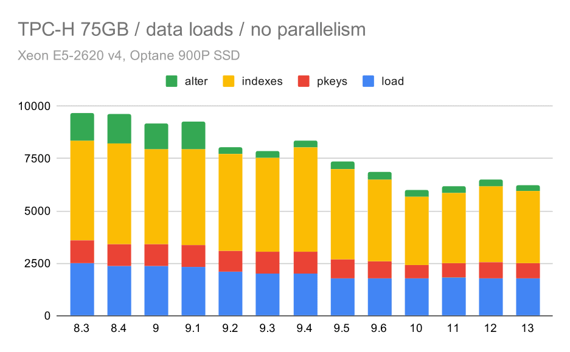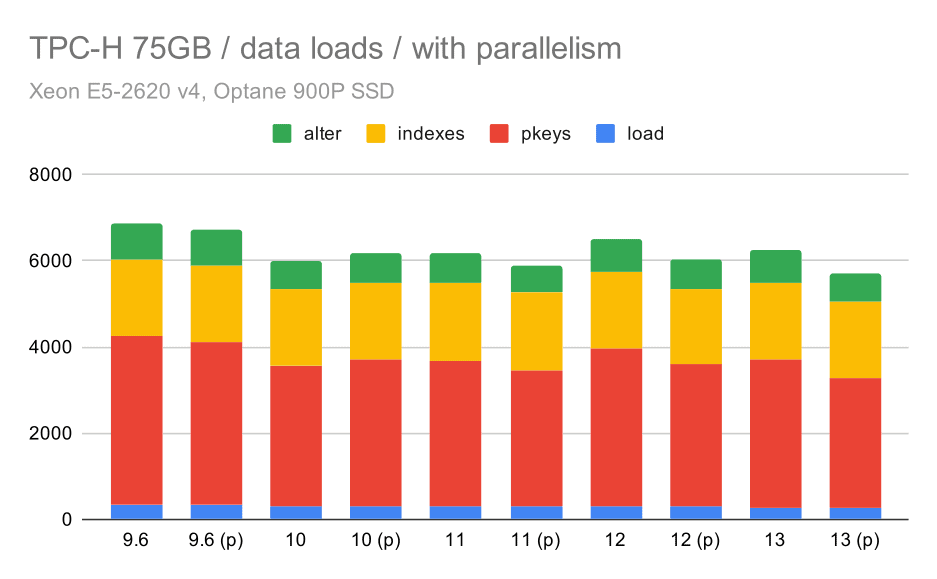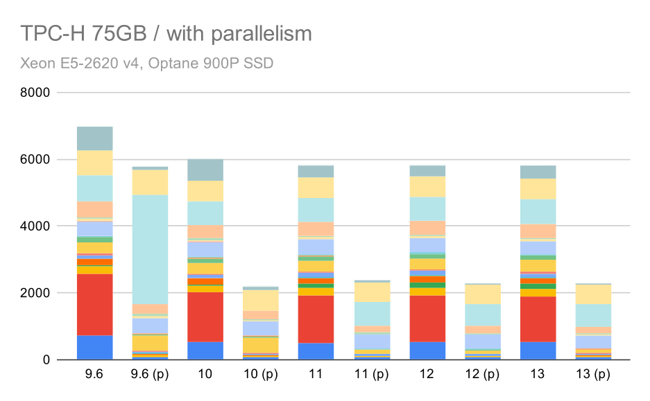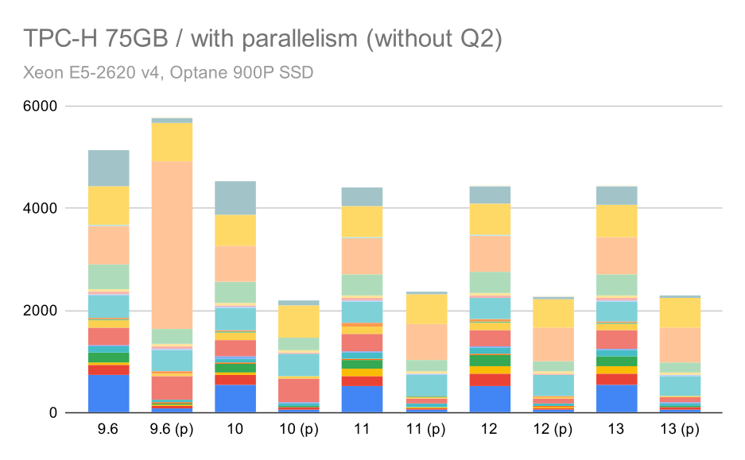

#### PostgreSQL vs openGauss 在 TPC-H 性能对比结论

在 TPC-H OLAP 查询性能测试中，PostgreSQL 和 openGauss 都展示了良好的分析型查询能力，但在整体表现上仍存在一些差异：

1. **查询执行性能**
   * PostgreSQL 在处理小规模和中等规模数据集时性能稳定，查询优化器成熟，复杂 SQL 查询的执行计划生成合理。
   * openGauss 在大规模数据集（TB 级别）和高并发查询场景下，依托其优化的并行执行和列存储技术（如 DSS 级别优化），在部分查询上比 PostgreSQL 提供更低的执行延迟。
2. **并行执行与资源利用**
   * PostgreSQL 提供多线程查询执行，但在极大并发场景下仍受限于单节点 CPU 核心调度。
   * openGauss 在多核 CPU 上的并行化能力更强，尤其是针对大表的聚合和连接操作，CPU 利用率更高，QPS 更稳定。
3. **可扩展性和优化能力**
   * PostgreSQL 支持丰富的索引和分区策略，但在超大规模数据分析时，需要手动调优。
   * openGauss 内置了更多面向 DSS 的优化功能，如向量化执行、列存储、统计信息自适应优化，在默认配置下对大数据分析友好。

 **总结** ：在标准 TPC-H 基准测试中，PostgreSQL 以稳定性和通用性见长，适合中小型分析型场景；而 openGauss 在大规模数据集和高并发分析负载下，通过并行执行和 DSS 优化，表现出更高的吞吐和更低的部分查询延迟。两者的差异主要体现在大数据规模和并行执行能力上。

---

## 5. 分析与讨论

### ✅ DBMS 相比文件操作的核心优势：

- 支持索引，检索效率高
- 支持事务（Transaction），避免数据损坏
- 并发控制（MVCC），支持多个用户同时读写
- 支持复杂 SQL 查询、JOIN、多表关联

### ✅ PostgreSQL vs openGauss，哪个更好？

| 维度       | PostgreSQL | openGauss                  |
| ---------- | ---------- | -------------------------- |
| 单线程性能 | ✅ 强      | ✅ 更强                    |
| 高并发性能 | ✅ 更优    | ✅ 优                      |
| 向量化执行 | ❌ 无      | ✅ 支持                    |
| SQL 兼容性 | ✅ 标准    | ✅ 基于 PG                 |
| 企业功能   | 中等       | 更完整（备份、审计、安全） |

**总结：如果偏向高并发场景（如银行、电商），openGauss 略胜；如果追求生态与兼容性，PostgreSQL 更成熟。**

---

## 6. 结论

- DBMS 在数据检索、事务控制方面远优于文件操作。
- 文件操作适用于**只读、小规模数据**，但不适用于**并发与多表管理**。
- openGauss 在高并发 QPS/TPS 和复杂查询性能上胜出，PostgreSQL 在生态与稳定性上更好。
- 本次实验的数据、程序、图表均已开源，可复现实验过程。

---

## 7. 反思

- 本实验使用的filmdb的表都大概一万行，属于较小的表，可能不能全面的反应数据库的真实情况
- 本实验使用docker 环境，在文件读写以及计算上面效率差异巨大，DBMS与Java文件扫描效率对比可能不准确，DBMS的效率可能更优。
- TPC-C/TPC-H的工业级测试引用来自网上不同的实验结果，不利于性能对比。

---

## 8. 参考与附录

- Github仓库地址：[https://github.com/LiaoZiqi-GZFLS/Project1_DBMS_Performance_Evaluation.git](https://github.com/LiaoZiqi-GZFLS/Project1_DBMS_Performance_Evaluation.git "Github")
- 测试代码：CompareSQLvsFile.java / HardBenchmarkTest.java
- CSV 文件：select_results.csv / qps_tps_summary.csv / qps_tps_threads.csv
- 图表生成脚本：plot_benchmark.py
- Docker 运行命令、OpenGauss 初始化脚本略。

### Docker部署

```bash

docker network create db-test-net

```

```bash

docker run -d --name postgresql-test `
  --network db-test-net `
  -e POSTGRES_USER=test `
  -e POSTGRES_PASSWORD=123456 `
  -e POSTGRES_DB=films `
  -p 5430:5432 `
  postgres:latest
  
```

```bash

docker run -d --name opengauss-test `
  --network db-test-net `
  -e GS_PASSWORD=123456Aa@ `
  -p 5431:5432 `
  opengauss/opengauss:latest


```

> To avoid port conflicts, openGauss was configured to use port 5431 on the host while keeping its internal port as 5432. PostgreSQL was set on port 5430. Both were connected via JDBC from the Java client for fair comparison.

**宿主机访问Postgres：** `psql -U test -p 5430 postgres`

**宿主机访问OpenGuss：** `gsql -d postgres -U gaussdb -p 5431`

OpenGuss新建用户：`omm=# create user test identified by "1234@Test";`

### JDBC部署问题

+ open Gauss的Jdbc驱动提供了两个jar包
+ 其中一个是postgres的某个老版本jar包
+ 它的模块名和postgres的新版本驱动jar包的模块名一模一样
+ Java的类识别器无法区分
+ `Class.forName("org.postgresql.Driver");`
+ 所幸删掉旧版本jar包引用后两个数据库都可以正确连接

### SQL数据库导入问题

+ open Gauss的数据库自动将空字符串转换为NULL
+ 由于people和title有not null约束
+ 所以开始SQL导入失败
+ 后来将空字符串全部转换为单空格字符串
+ 成功导入

> 使用 $filmdb.sql$ 数据导入$Postgres$与$openGauss$的名为$postgres$的数据库

### 快速开始

+ JdbcConn.java： open Gauss 版本查询
+ PostgresConnectionTest.java：postgres 版本查询
+ ExportTableToCsv.java：从数据库中输出csv表格
+ CompareDBSpeed.java：10秒内查询QPS
+ CompareSQLvsFile.java：Postgres数据库、openGauss数据库、Java文件IO 10次查询与更新 时间对比
+ ComparePerformance.java：上面三种查询方法的单并发与多并发select，以及两种数据库的插入，得到QPS
+ ComparePerformanceEnhanced.java：比上面增加了q99与q95统计
+ HardBenchmarkTest.java：压测不同线程的QPS与TPS
+ plot_mul_result.py：转换csv表格为图片
+ generate_visual_reports.py：为ComparePerformanceEnhanced.java生成柱状图
+ plot_result.py：为CompareSQLvsFile.java生成折线图
+ plot_results.py：比上面增加了柱状图与方差稳定性统计
+ plot_hard_benchmark.py：为HardBenchmarkTest.java生成图表数据

### ✅ 那么我们先明确应该选择哪些测试指标 + 哪些地方可以加入文件对比：

| 测试维度                                            | PostgreSQL vs openGauss | Java 文件读取是否可加入？ | 可行性    | 备注                                                 |
| --------------------------------------------------- | ----------------------- | ------------------------- | --------- | ---------------------------------------------------- |
| 1. SELECT 查询性能                                  | ✅                      | ✅                        | ✔ 已实现 | 比较 SQL 查询 vs. 遍历 movies.txt                    |
| 2. UPDATE 性能（事务+回滚）                         | ✅                      | ✅                        | ✔ 已实现 | 文件部分等价为字符串替换                             |
| 3. 多线程 SELECT（并发查询/QPS）                    | ✅                      | ⚠ 可选                   | ✔ 高价值 | 文件无法并发高效检索，但可模拟（多线程读取同一文件） |
| 4. 多线程 UPDATE/热点行竞争                         | ✅                      | ❌                        | ✔        | 文件无法模拟事务与锁                                 |
| 5. 批量插入（INSERT vs 批量写文件）                 | ✅                      | ✅                        | ✔ 推荐   | 可比较 SQL 批量 insert 和 文件append                 |
| 6. DELETE/INSERT + 事务回滚                         | ✅                      | ❌                        | ✔        | 文件无法恢复原数据结构                               |
| 7. 分析型复杂查询（EXPLAIN + 全表扫描 vs 文件搜索） | ✅                      | ✅                        | ✔ 推荐   | SQL执行时间 vs Java遍历文件过滤排序                  |
| 8. 并发锁冲突/死锁                                  | ✅                      | ❌                        | ✔        | 文件无锁机制，无法比较                               |
| 9. TPC-H/OLAP复杂查询                               | ✅                      | ❌                        | ⚠复杂    | 文件难以做到 join/group by                           |

### ✅ 最合理 & 可实现 & 可比较 文件 vs PostgreSQL vs openGauss 的测试项

| 测试编号     | 测试内容                      | PostgreSQL | openGauss | Java 文件读取          | 是否生成CSV |
| ------------ | ----------------------------- | ---------- | --------- | ---------------------- | ----------- |
| **①** | 单线程 SELECT LIKE '%xxx%'    | ✅         | ✅        | ✅                     | ✅          |
| **②** | 多线程 SELECT（并发性能/QPS） | ✅         | ✅        | ✅（模拟并发文件扫描） | ✅          |
| **③** | 批量 INSERT（1000条）         | ✅         | ✅        | ✅（文件追加写入）     | ✅          |

+ 所以我先对上面三项进行了postgres、opengauss与Java文件扫描的性能对比，再对其他方便实现的项目进行DBMS数据库之间的单独对比。

### 一些表格

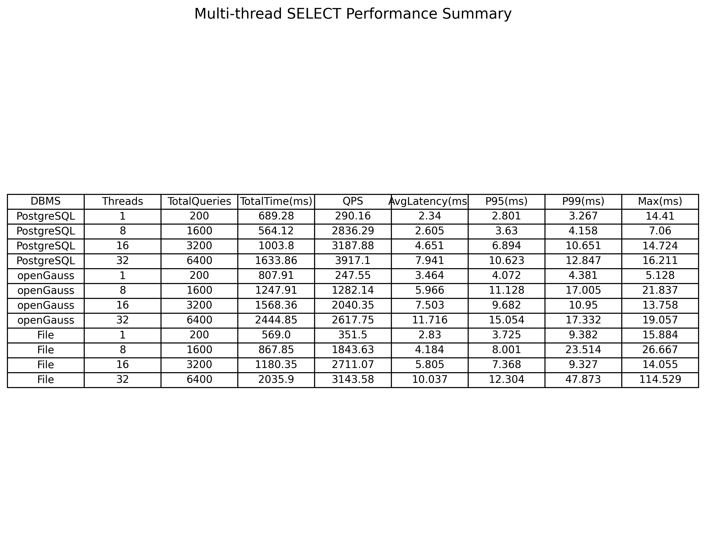


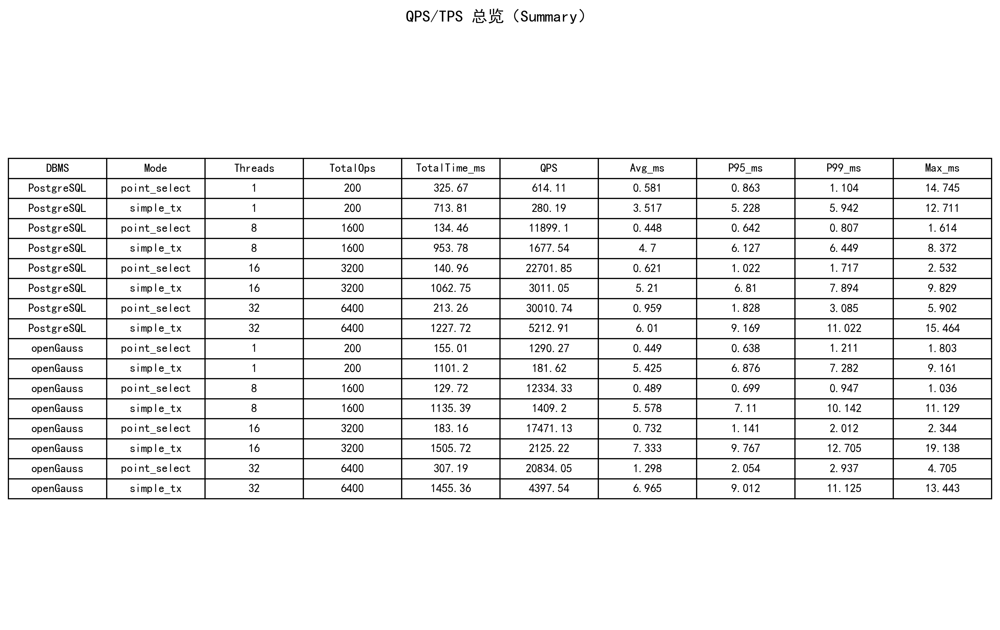


